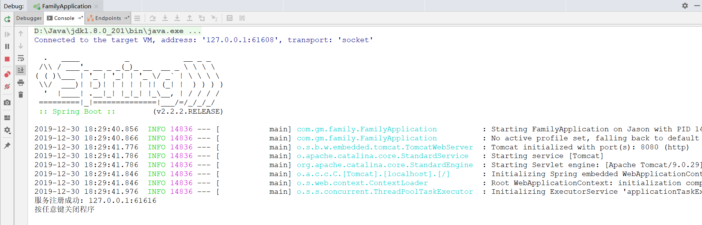

ＣＣ即时通讯服务

# 前言 #
- CC是一款即时通讯服务框架,框架的宗旨是 **开箱即用**
- 使每一个企业项目只要引入了cc框架包即可马上拥有即时通讯能力。

# 开源 #

- 开箱案例

  
  
- 正在进行

# 附言 #

- ＱＱ：569284276
- 微信: 同上
- Mail: 569284276@qq.com
- Blog: [gmlee.cn](http://gmlee.cn/)
- Ｑ群: [８０８０实验室](https://jq.qq.com/?_wv=1027&k=5vD1Zh6 "５３７９５０７５１")